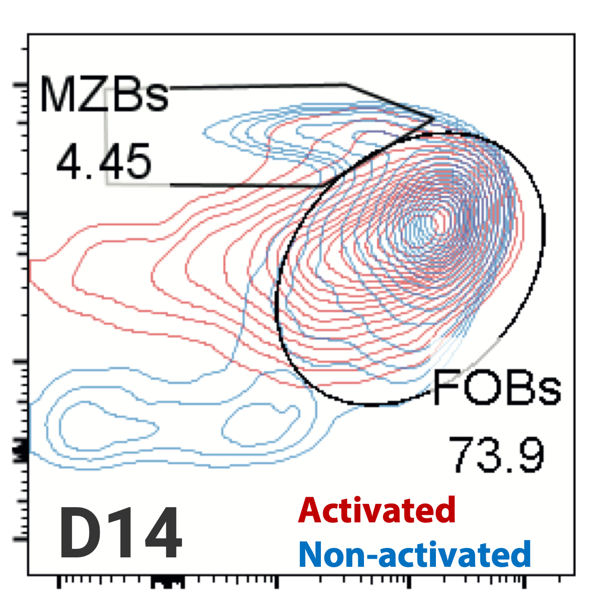
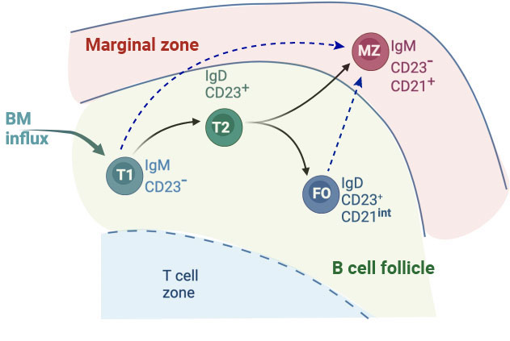
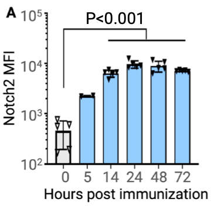

class: center, middle, inverse

## 3. Do the rules governing MZ B cell dynamics modulate during an ongoing immune response?


???
What are their dynamics in an active immune response?

Modelling the dynamics of development, death and differentiation in animals that are immunized with T-dep antigen.

---
### Immune-response dynamics of B lymphocytes

<hr>

- #### Immune activation induces seismic changes in B cell behaviour.

  - Exposes them to a wide variety of interactions and stimuli.
 
  - Triggers dramatic changes in their dynamics.

--

- Activated B cells **proliferate** rapidly and massively and then participate in the **germinal center (GC)** reactions.

--


- GC reactions:

>  1. Affinity maturation $\rightarrow$ Highly specific antibodies.
>  2. Class-switching to IgG (IgA/IgE depending on the antigenic-context).

--


- GC B cells differentiate into either antibody-secreting **plasma** B cells or become **memory** B cells.

<br>
<hr>
---
###  Does immune activation modulate B cell differentiation pathways?
<hr>


.pull-left[
.center[
**CAR/C<sub>&gamma;1</sub>Cre reporter mice**
]

- Responding B cells permanently express CAR.

- Immunized with T-dependent antigen: NP-CGG.

- Leads to activation of FO B cells.

]


.pull-right[

```{r echo=FALSE, fig.retina=3, out.width='65%'}


```
]

.right[
##### Tea Babushku
]
--

<br>


<h3 style="color:#006789;">
A substantial fraction of activated FO B cells acquire MZ B cell phenotype.
</h3>


???
  - New or altered precursor-progeny relationships?

  - Increase or decrease cellular flux between B cell subsets?
  

### How does the process of B cell activation modulate B cell fate-determination?

---

### Plasticity in B cell differentiation pathways
<hr>


<br>

```{r echo=FALSE, fig.retina=3, out.width='50%'}

knitr::include_graphics("figures/bcell_matu.jpg")
```

???

### BCR signalling strength is believed to be the deciding factor.
Strong signals drive differentiation into FO and weak signals lead to MZ fate. 
  
---
count: false

### Plasticity in B cell differentiation pathways
<hr>

<br>

```{r echo=FALSE, fig.retina=3, out.width='50%'}


```


- Fully mature follicular (FO) and very early stage transitional (T1) B cells can also  develop into MZ B cells depending on **Notch2** signal availability.
.right[
##### Lechner *et al.* Nat Comm 2021
]

???

### Factors governing B cell fate-determination remain unknown.  


---
<hr>


.pull-left[
<br> 
<br>
- *In vitro* stimulation of purified FO B cells results &asymp; 100 fold increase in Notch2 expression.
<br>
]


.pull-right[


```{r echo=FALSE, fig.retina=3, out.width='55%'}


```
]


--

<br>

.pull-left[
.center[
- **Notch2-IC/C<sub>&gamma;1</sub>Cre  reporter mice**
]

> All responding B cells have constitutively active Notch2 signalling.

> Immunized with T-dependent antigen: NP-CGG.

]


.pull-right[

```{r echo=FALSE, fig.retina=3}

knitr::include_graphics("figures/notch-cre.png")
```
]

.right[
##### Data from Zimber-Strobl group
]

---
class: middle
<hr>

### 1. To what extent the cellular flux between B cell subset is modulated during an immune response?

--

### 2. How do self-antigen induced BCR 'tonic signaling' and Notch2 mediated signaling interplay to drive MZ fate determination at steady states?

<hr>
---
### Dynamical modelling of B cell differentiation during an immune response
<hr>

#### CAR/C<sub>&gamma;1</sub>Cre mice immunized with NP-CGG antigen.


```{r echo=FALSE, fig.retina=3, out.width='125%'}


```

---
class: center, inverse, middle

##Thanks!


