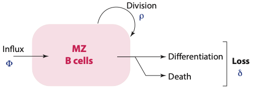
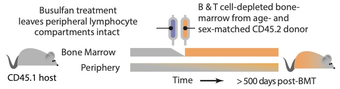

class: center, middle, inverse

## 1. How are MZ B cell numbers and clonal-diversity regulated throughout life?


---
class: center
## Homeostasis of MZ B cells 
<hr>


```{r echo=FALSE, fig.retina=3, out.width='55%'}


```


--

<h3 style="font-size:150%;color:#006789;">
Does the relative contribution of these processes vary across a lifetime?
</h3> 


--

<br>

### What are the rules of their replacement?
>  Random displacement? Hierarchy? </br>
>  Conveyor belt? First-in-last-out?

---

<hr>
<br>

### MZ B cell clonal repertoire:

- Augmented by flow of new cells from the BM <span style="color:#035AA6;"> &#8594; enhances diversity.</span>


- Sustained by proliferation (homeostatic self-renewal) <span style="color:#035AA6;"> &#8594;skews diversity</span>


- Depleted by loss of cells (by death and onward differentiation).

--


<h3 style="color:#006789;">
Can we quantify all of these processes to understand how the repertoire is established and how it evolves over an individual’s lifespan?
</h3> 


---
class: center, top

### Tonic replenishment of MZ B cells in mice
<hr>


```{r echo=FALSE, fig.retina=3, out.width='80%'}


```

--

<br>

```{r echo=FALSE, fig.retina=3, out.width='60%'}


```


.right[
#####  Seddon lab UCL
]

---

class: center, middle

<hr>

```{r echo=FALSE, fig.retina=3}


```

.right[
##### Data from Seddon lab
]

<hr>
---
### Niche sizes are aggregates of production and turnover
<hr>


.pull-left[

```{r echo=FALSE, fig.retina=3, out.width='120%'}


```

]

.pull-right[

.center[
<p style="font-size:90%"> 
Neutral model: constant rates
</p>


$$
\dot{M} = \phi \, P(t) + \rho \, M - \delta \, M 
$$

$$
\dot{M} = \phi \, P(t) + \psi \, M 
$$
<p style="font-size:90%; color:#595959"> 
P: upstream precursor population.
</p>
]
]

--

<br>


$\psi$ is the net growth rate:  
 the propensity of a cell for division minus its propensity for loss $(\rho - \delta)$

--

<br>

#### The ability of a cell and its progeny to persist within the compartment over time — ‘Homeostatic fitness'.

<hr>

???
and we can express this mathematically in a simplest model like this ...

to simplify further... we can combine the cells ability to divide and turnover into one single parameter $\psi$.
Now e just have 2 parameters!!! Voila!
We're always looking to tie the maths to biological reality - you can interpret the inverse of phi as the average
lifetime of a clone, rather than a single cell.

---
class: center
<hr>

```{r echo=FALSE, fig.retina=3, out.width='90%'}


```


<p style="font-size:85%"> 
<span style="font-weight:bold">Upslope – </span> How fast host cells are replaced by donor-BM-derived cells. </br>
<span style="color:#006789">  Driven by the rate of influx and growth. </span> 
</br>
<span style="font-weight:bold">Set point – </span>  Whether replacement is complete or incomplete. </br>
<span style="color:#006789"> Heterogeneity within the compartment.</span>
</p>

--

<br>

```{r echo=FALSE, fig.retina=3, out.width='90%'}


```

<hr>

---

### Division history of MZ B cells
<hr>


- Measuring Ki67 helps untangle division (&rho;) and loss (&delta;).

```{r echo=FALSE, fig.retina=3, out.width='80%'}


```


--

- #### Possible explanations for differences in behavior of donor and host cells:

  1. Residual Ki67 expression on newly entered cells, as the donor population is initially highly enriched with recent BM emigrants.

--

  2. Intrinsic differences in the ability to divide or die of young (donor) and relatively older (host) MZ B cells.
---

### Fits from the Neutral model
<hr>

```{r echo=FALSE, fig.retina=3, out.width='85%'}

knitr::include_graphics("figures/MZ_fits.png")
```

<hr>

---
class: middle, center
<hr>

```{r echo=FALSE, fig.retina=3, out.width='90%'}


```

<br>

### Almost all the Ki67 expression in the MZ pool is a residual signal from upstream precursors


<hr>

---


### Potential models of MZ B cell homeostasis
<hr>

.pull-left[

```{r echo=FALSE, fig.retina=3}


```
]

--

.pull-right[

```{r echo=FALSE, fig.retina=3}


```
]

--

<br>


```{r echo=FALSE, fig.retina=3, out.width='45%'}


```


<hr>


