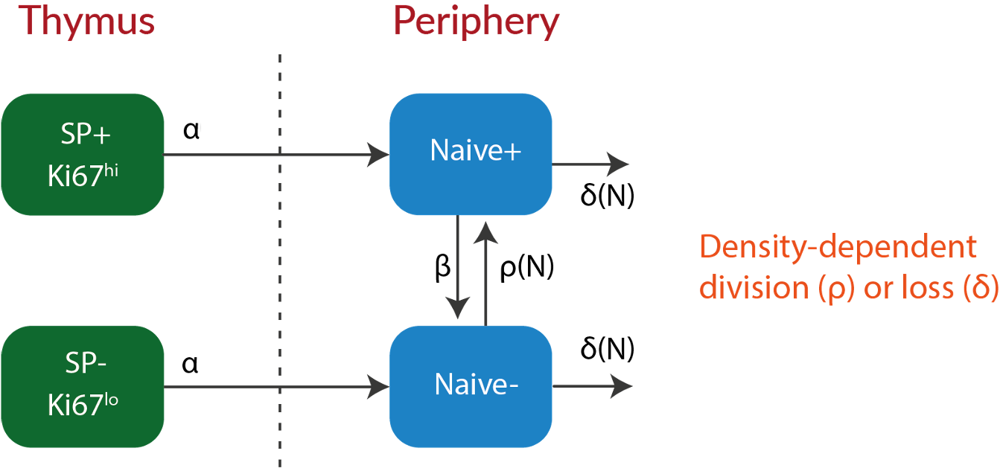

class: middle

### 1. Ontogeny dataset

Total counts and proportions of $\small \text{Ki}67^{high}$ cells from d5 to d300 in mice.


### 2. Timestamp dataset

Data from a mouse system that allows us to track cohorts of naive T cells as they leave the thymus.

</br>

???

### Our goal is to use these data together to test grand-unified models of Naive T cell homeostasis from birth to death.

---

### Dynamics of Naive T cell pool size and Ki67 expression
<hr>


```{r echo=FALSE, fig.retina=3, out.width='80%'}

knitr::include_graphics("figures/counts_data.jpeg")
```

--

```{r echo=FALSE, fig.retina=3, out.width='80%'}

knitr::include_graphics("figures/ki_data.jpeg")
```

???

### .center[Measuring cell division in T lymphocytes]
<hr>

- $\small \text{Ki}67$ — a nuclear protein expressed during cell-division.

</br>

---
class: center
### .left[Neutral and Competition Models]
<hr>

```{r echo=FALSE, fig.retina=3, out.width='420'}


```

.left[
$$
\small
\begin{aligned}
&N(t) = N^+(t) + N^-(t); \quad \quad 
&\kappa(t) = \frac{N^+(t)}{N(t)} 
\end{aligned}
$$
]

???
notice here we allow rates of loss and/or division to vary with the total pool size N -
to model any effect of competition or quorum sensing
--

</br>

<strong style="color: #035AA6;"> Models are represented as systems of ordinary differential equations (ODEs). 
</br>

.shadedbox[
$$
\begin{aligned}
&\dot N^+ = \alpha + \rho(N) \, (2\,N^- + N^+) - (\beta + \delta(N)) \, N^+ \\
&\dot N^- = \alpha + \beta N^+ + \delta(N)) \, N^-
\end{aligned}
$$
]

---
class: center

## Model validation
<hr>

$$
\begin{aligned}
&y_i \sim \text{normal}(\mu_i, \sigma) \quad \quad \quad \quad \quad \quad  &[\text{likelihood}] \\
&\mu_i = f(\text{time}_i, \theta)  &[\text{model}]\\
\end{aligned}
$$


$\theta:$ Vector of parameters $[\alpha, \beta, \delta, \sigma]$ within the model.

--

<span style="color:#035AA6;">
$$
\begin{aligned}
\\
&\alpha \sim \text{uniform}(0.0, 1.0) \quad \quad \quad \quad \quad \quad  &[\alpha \text{ prior}] \\
&\rho \sim \text{normal}(0.005, 0.01)   &[\rho \text{ prior}] \\
&\delta \sim \text{normal}(0.05, 0.05)   &[\delta \text{ prior}] \\
& \sigma \sim \text{uniform}(0, 5) &[\sigma \text{ prior}]
\end{aligned}
$$
</span>

--

</br>

.center[
<strong style="color: #404040;"> Models are fitted simultaneously to the total counts and the proportions of Ki67+ cells. </strong>
]


.shadedbox[
$$
\begin{aligned}
& \small \text{log(Total counts) } \Rightarrow \quad &y_1 \sim \text{normal}(\mu_1, \sigma_1)\\
& \small \text{logit(Ki}67^+\text{ proportions}) \Rightarrow \quad &y_2 \sim \text{normal}(\mu_2, \sigma_2)\
\end{aligned}
$$
]


.right[... continued]

???
Each model was fitted simultaneously to the timecourses of $\small log(\text{counts})$   proportions of $\small logit(\text{Ki}67^{high})$ cells.


We form a joint likelihood which is the probability density of data across the parameter distribution $\theta$ by assuming that the errors are normally distributed. 

---

<hr>

### Bayesian approach:
$$
P(\hat \theta | y_1, y_2) = \frac{P(y_1 | \hat \theta) \cdot P(y_2 | \hat \theta) \cdot P(\theta)}{P(y_1) \cdot P(y_2)} 
$$
--

</br>

### Sampling the posterior:
Parameters are sampled from the joint density $P(\theta)$ using **Hamiltonian Monte Carlo** (H-MC) algorithm.

  - Models are coded in _Stan_ language and fitted using the **NUTS** sampler.
  - Posterior distributions and model fits are analyzed using _R_ package `rstan`. 
  
<hr>
???
Normalized product of probability densities of both datasets and the prior distribution of params.

- This probability density is then used to update our prior beliefs in model parameters using the bayesian approach.


We judge the models under consideration based on **parsimony** and their ability to predict **New observations** which is also called as out of sample prediction error.


.shadedbox2[
Occam's razor:
Models are selected based on **parsimony** and their ability to predict **New observations** &mdash; (out-of-sample prediction error).
]


---
## Model selection
<hr>


### Leave-One-Out cross validation:

```{r echo=FALSE, fig.retina=3, out.width="40%"}

knitr::include_graphics("figures/looic.png")
```


$$
\text{Leave-One-Out information criterion:} \,\,
\small \text{LooIC} = -2 \,\, \sum_{i=1}^n \, Z_i
$$

.center[
<h3 style="color:#9e423c; font-size:150%;">
&#8658; LooIC measures the model's ability to predict new data.
</h3>
]


.right[... continued]


???
We measure this  out of sample prediction error using Leave-One-Out cross validation, in which a single observation is treated as test dataset and rest of the observations are trated as training data. The process is repeated for all 'n' observations and the prediction error for each left-out test set is aggregated to calculate Leave-One-Out information criterion (LOOIC).


---
<hr>

### Scaling the models:

$$
\small \Delta \text{LooIC} = \text{LooIC}_i - \text{min}(\text{LooIC})
$$

  - $\small \Delta \text{LooIC} = 0 \Rightarrow$ Best-fit model. 
  - Higher values suggest poorer support from the data.

???
Only relative values of LooIC are meaningful

--

</br>

### Relative support:

<u>Analog of Akaike weight</u>

.shadedbox[
$$
\omega_i = \frac{\exp(-\frac{1}{2} \, [\Delta \text{LooIC}]_i)}{\sum_m^M  \, \exp(-\frac{1}{2} \, [\Delta \text{LooIC}]_m)}
$$
]

- Proportional statistical support among the models under consideration.

???
We then used the estimated LOO-IC values to assess the relative support for models using the analog of the Akaike weight which gives us the probability that a given model will explain new data better than other models considered in this analysis.


