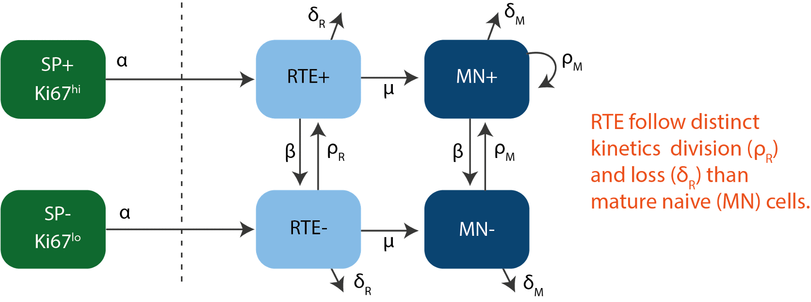
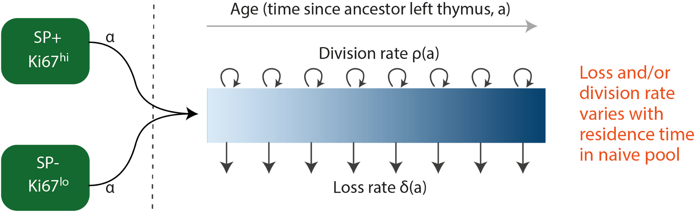

class: center

</br>


```{r echo=FALSE, fig.retina=3}
## function for exporting a data table of delta loo ic values and akaike weights
#takes 2 separate lists of the name of the models and loo-ic values
library(kableExtra)
model_compare <- function(modelnamelist, looiclist){
  deltaloo_list <- looiclist - min(looiclist) # delta loo-ic
  akaikewt_numerator <- function(x) exp(-0.5 * x) ## akaike wt
  akaikewt_list <- sapply(deltaloo_list, akaikewt_numerator) * 100/sum(exp(- 0.5 * deltaloo_list))
  export_table <- data.frame('Model' = modelnamelist,
                             'deltaloo' = round(deltaloo_list, 2),
                             'Akaike_wt' = round(akaikewt_list, 2))
  colnames(export_table)[2:3] <-  c(paste0('\u0394', 'LooIC'), 
                                    paste0('Akaike weight ', '\u0025'))
  return(export_table)
}

models_list1 <- c('Neutral', 'Density-dependent proliferation (LIP)', 'Density-dependent loss')
looic_cd4_loolist1 <- c(132.9, 134.5, 127.7)
cd4_table1 <- model_compare(models_list1, looic_cd4_loolist1)
cd4_table1 %>%
   kable(caption = "Table: Statistical analysis for CD4 data") %>%
  kable_styling(font_size = 15) %>%
  row_spec(which(cd4_table1$ΔLooIC == 0), bold = T, color = "navy", background = "skyblue")

```


```{r echo=FALSE, fig.retina=3}

knitr::include_graphics("figures/cd4_compare1.jpeg")
```


---
class: center

</br>


```{r echo=FALSE, fig.retina=3}

looic_cd8_loolist1 <- c(153.0943, 139.9556, 145.4329)
cd8_table1 <- model_compare(models_list1, looic_cd8_loolist1)
cd8_table1 %>%
  kable(caption = "Table: Statistical analysis for CD8 data") %>%
  kable_styling(font_size = 15) %>%
  row_spec(which(cd8_table1$ΔLooIC == 0), bold = T, color = "navy", background = "skyblue")

```


```{r echo=FALSE, fig.retina=3}

knitr::include_graphics("figures/cd8_compare1.jpeg")
```


---
## Tracking RTE dynamics
<hr>


---

### .left[Two-compartment models]
<hr>


```{r echo=FALSE, fig.retina=3, out.width='550'}


```


</br>

--

```{r echo=FALSE, fig.retina=3, out.width='550'}

knitr::include_graphics("figures/rte2_diag.png")
```


---
class: center

</br>


```{r echo=FALSE, fig.retina=3}
models_list2 <- c('Neutral', 'Density-dependent proliferation (LIP)', 'Density-dependent loss', "RTE", "RTE: maturation linked division")
looic_cd4_loolist2 <- c(132.9, 134.5, 127.7, 134.57, 131.43)
cd4_table2 <- model_compare(models_list2, looic_cd4_loolist2)
cd4_table2 %>%
  kable(caption = "Table: Statistical analysis for CD4 data") %>%
  kable_styling(font_size = 15) %>%
  row_spec(which(cd4_table2$ΔLooIC <= 3), bold = T, color = "navy", background = "skyblue")

```


```{r echo=FALSE, fig.retina=3}

knitr::include_graphics("figures/cd4_compare2.jpeg")
```

---
class: center

</br>


```{r echo=FALSE, fig.retina=3}
looic_cd8_loolist2<- c(153.0943, 139.9556, 145.4329, 151.7188, 154.3836)
cd8_table2 <- model_compare(models_list2, looic_cd8_loolist2)
cd8_table2 %>%
  kable(caption = "Table: Statistical analysis for CD8 data") %>%
  kable_styling(font_size = 15) %>%
  row_spec(which(cd8_table2$ΔLooIC <= 3), bold = T, color = "navy", background = "skyblue")

```


```{r echo=FALSE, fig.retina=3}

knitr::include_graphics("figures/cd8_compare2.jpeg")
```


---

### Adaptation: age-structured model
<hr>


</br>

```{r echo=FALSE, fig.retina=3, out.width='600'}


```

</br>

Naive T cells of age 'a' and Ki67 expression 'k' are tracked across time 't', by analytically solving the 3-dimensional PDE,

.shadedbox[
$$
\begin{aligned}
\frac{\partial N}{\partial t} + \frac{\partial N}{\partial a} - \beta \, k \, \frac{\partial N}{\partial k}= -(\rho(a) + \delta(a)) \, N(t, a, k)
\end{aligned}
$$
]

---
class: center

</br>


```{r echo=FALSE, fig.retina=3}
models_list3 <- c('Neutral', 'Density-dependent proliferation (LIP)', 'Density-dependent loss',
                  "RTE", "RTE: maturation linked division", "ASM: loss rate varying with cell-age",
                  "ASM: division rate varying with cell-age")
looic_cd4_loolist3 <- c(132.9, 134.5, 127.7, 134.57, 131.43, 133.6814, 129.8941)
cd4_table3 <- model_compare(models_list3, looic_cd4_loolist3)
cd4_table3 %>%
   kable(caption = "Table: Statistical analysis for CD4 data") %>%
  kable_styling(font_size = 15) %>%
  row_spec(which(cd4_table3$ΔLooIC <= 3), bold = T, color = "navy", background = "skyblue")

```


```{r echo=FALSE, fig.retina=3}

knitr::include_graphics("figures/cd4_compare3.jpeg")
```


---
class: center

</br>

```{r echo=FALSE, fig.retina=3}
looic_cd8_loolist3<- c(153.0943, 139.9556, 145.4329, 151.7188, 154.3836, 142.0947, 152.1801)
cd8_table3 <- model_compare(models_list3, looic_cd8_loolist3)
cd8_table3 %>%
   kable(caption = "Table: Statistical analysis for CD8 data") %>%
  kable_styling(font_size = 15) %>%
  row_spec(which(cd8_table3$ΔLooIC <= 3), bold = T, color = "navy", background = "skyblue")

```


```{r echo=FALSE, fig.retina=3}

knitr::include_graphics("figures/cd8_compare3.jpeg")
```

---
<h2 style="font-size:180%;">
Equivocal support for age-structured and density-dependence models
</h2>
<hr>

<h3 style= font-size:140%">
Step1: <span style="color:#9e423c;"> Verify the parameters </span>
</h3>

.center[
Comparison of parameter estimates - **naive CD4** data.
]

```{r echo=FALSE, fig.retina=3, out.width='65%'}

knitr::include_graphics("figures/cd4_par_compare.jpeg")
```


???
So what do we do in these situations, 
one trick is to look at the parameter estimates and if you are lucky for some of the models some estimates wont make sense or would have values that are not possible physiologically. So we can rule those models out.

Unfortunately, we are not that lucky.
---
count: false

<h2 style="font-size:180%;">
Equivocal support for age-structured and density-dependence models
</h2>

<hr>

<h3 style= font-size:140%">
Step1: <span style="color:#9e423c;"> Verify the parameters </span>
</h3>

.center[
Comparison of parameter estimates - **naive CD8** data.
]

```{r echo=FALSE, fig.retina=3, out.width='65%'}

knitr::include_graphics("figures/cd8_par_compare.jpeg")
```

???
### Whats Next?
- Measuring Ki67 expression in **RAG-GFP** neonatal mice. </br>
&#8618; Information on the extent of cell division in young naive T cells early on in life.

- Stochastic models (Agent-based) to predict **RAG-GFP** data. </br>
&#8618; Simulating TCR repertoire dynamics using the parameter estimates from the best-fit model.

---
count: false

class: center, middle

# Step2:
<h1 style="color:#9e423c;">
Add more data?
</h1>
