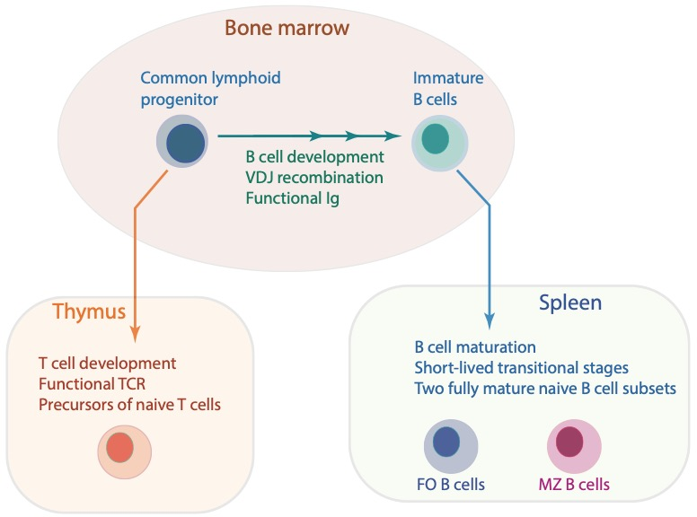

class: top, center
## Development of lymphocytes
<hr>


```{r echo=FALSE, fig.retina=3, out.width='80%'}


```


???

Parallels between B and T cell development

Pro - Pre - selection and division - Immature B cells exit to periphery

End of the world post apocalyptic scenario
you are an engineer and the fate of the world depends on how you make this one weapon that selectively neutralizes the aliens invading our planet

???

---

## B cell maturation in the spleen
<hr>

- B cells transition through **short-lived** developmental stages in the spleen.


- Late-stage transitional (T2) B cells bifurcate into fully mature Follicular (FO) or Marginal Zone (MZ) B cells.

<br>


```{r echo=FALSE, fig.retina=3, out.width='60%'}

knitr::include_graphics("figures/bcell_matu.jpg")
```

---

## Division of labour and space
<hr>

<!---
#### Division of labour within B cells
--->

<h4 style="color:#035AA6; font-size:100%"> 
Marginal Zone is an anatomical barrier that divides lymphocyte-rich follicles and the erythrocyte-rich red pulp.
</h4>

.pull-left[
```{r echo=FALSE, fig.retina=3, out.width='100%'}

knitr::include_graphics("figures/MZ_viz1.jpg")
```

.right[*Zimber-Strobl group*]

]

???
5 % of circulation goes through spleen
blood cicrulation opens into marginal sinus where blood slows down so that Mphages and B cells guarding the sinus can filter it for antigens/pathogens.

--

.pull-right[

- MZ B cells are strategically positioned to identify and respond to **blood-borne** antigens. 
<h4 style="color:#9e423c;">&#8658; Gatekeepers of the immune system.</h4>
{{content}}

]


???
MZ B cells are strategically positions to locate pathogens that breach systemic barrier and emerge in blood.

--

- FO B cells typically respond to antigens presented by Dendritic cells and Macrophages in a **T cell dependent manner** and produce high-affinity antibodies.

---

## Gatekeeping and much more...
<hr>


<h4 style="color:#035AA6;">
MZ B cells detect and neutralize pathogens carrying conserved molecular signatures  without T cell help.
</h4>

--

  &#9901;  They are equipped with **Pattern-recognition-receptors** and **Poly-reactive** clones.

  
--
  
  &#9901; High expression of **Toll-like** and **complement** receptors $\rightarrow$ Particulate-antigen sensing.

--
  
  &#9901; Constitutive pre-activated state.


???
In addition to this frontline role,
unique programming and constitutive pre-activated state
--

<br>

<h3 style="color:#a64d79;">
Rapid initiation of protective antibody responses encapsulated bacteria and some blood-borne viruses.
</h3>

---

<hr>

<br>


IBS patients show MZ related increased vulnerability to BB

Reduction in MZ B cell numbers in splenectomized patients, infants and elderly increases risk of multiple bacterial infections


<hr>
---

<hr>

- #### MZ B cells are responsible for generation of **Natural antibodies.** 
  - Pre-made reservoir of antibodies in healthy individuals without previous immunizations/infections.
  - Natural antibodies limit the dissemination of pathogens. 
  - Pivotal in the early phases of infection and before the highly specific T and B cell response is engaged.

--

- #### Natural antibodies also play a significant role in controlling **autoimmune pathologies**.
  - Indeed, in humans MZ B cells are associated with
      - Sjögren’s syndrome, 
      - Graves’ disease and
      - autoimmune vasculitis.


---

<hr>

### Jack of all trades

+ Response against **T-independent antigens** predominantly comes from MZ B cells.

--

+ They **transport** captured antigens to the follicles.

--

+ They present antigens to T cells and activate them, faster than FO B cells.

--

+ They are also capable of forming germinal centers that lead to somatically mutated and class-switched memory.

<br>

--

.center[
### MZ B cells represent a crossover between innate and adaptive immunity, spearheading early antibody responses against systemic pathogens
]

???
T- antigens, in general failure to elicit high-affinity antibody response by FO B cells.


  

