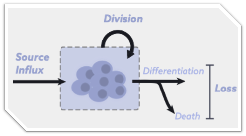

# .center[What are FM and MZ B cells]
<hr>

## B cell development in BM

Parallels between B and T cell development

Pro - Pre - selection and division - Immature B cells exit to periphery

???

End of the world post apocalyptic scenario
you are an engineer and the fate of the world depends on how you make this one weapon that selectively neutralizes the aliens invading our planet

???

---

## B cell development in periphery

Immature B cells $\rightarrow$ B1 B cells and   transitional B cells $\rightarrow$ FM and MZ B cells $\rightarrow$ GC and Memory

---
# Why MZ B cells are important? 

## Gatekeepers!
immunity against blood borne bacteria and viruses 

splenectomized individuals, infants etc.

IBS patients show MZ related increased vulnerability to BB

---

## Natural antibodies
poly clonal repertoire, TLR 
In combination with B1 B cells they produce natural antibody repertoire
pre-made reservoir of antibodies

During the early phases of infection and before specific antibodies are produced, natural antibodies limit the dissemination of pathogens. 

Natural antibodies are found in the serum of healthy individuals independently of previous immunizations, are mostly of IgM isotype and bind several antigens with low affinity 

ready to fight

---

## Response against T-independent antigens

In general failure to elicit high-affinity antibody response by FO B cells.
 
B1 and MZ B cells identify these antigens -- common molecular determinants conserved through evolution.

Low affinity antibodies that bind to multiple ligands.
TLR and complement receptors.

Targets for innate response:
IgM opsonizes the pathogens and enhances the innate immune response of macrophages


---

## Effcient and early response 

rapid antigen presentation and shuttling between MZ and T cell zones
rapid activation of T cell
early response to pathogens that breach systemic barriers and emerge in blood
before the high-affinity response from FM B cells takeover
however, they are also capable of exhibiting a more classical B cell phenotype and differentiate into antibody-secreting cells and form germinal centers that lead to somatically mutated and class-switched memory cells

---
# Whats the question? 

# How are they maintained throughout life?

--

## influx from precursors
--

### Shifting paradigms of MZ B cell development.

T2 or FM as their source?


### replenishment of MZ B cell repertoire

---

## Cell loss
### Death and onwards differentiation into memory and antibody producing cells.

### Depletion of repertoire
--

## Cell division 
### Homeostatoc division

### Sustenance of ?diversity?
---

## Complexity & Dynamism in MZ B cell homeostasis:
<hr>

```{r echo=FALSE, fig.retina=3, out.width='50%'}


```


--

> Multiple processes regulate the numbers and diversity of naive T cells.

> Contribution of these processes to naive T cell maintenance may vary with time.

--

We are going to measure these processes. $\phi, \delta, \rho$.
</br>

.center[
<h3 style="color:#9e423c;">
Understanding the development and maintenance of our T cell repertoires requires quantifying their ecology.

</h3>
]

<hr>

???

- In many ways it is an ecosystem - We need to quantify T cell ecology to understand the development and maintenance of our immune repertoires.

---


## MZ repertoire
<hr>

--

- augmented by flow of new cells from the thymus <span style="color:#035AA6;"> &#8594; enhances diversity.</span>

--
  
- sustained by proliferation (homeostatic self-renewal) <span style="color:#035AA6;"> &#8594;skews diversity</span>
  
--


- depleted by loss of cells (by death and onward differentiation).

--

<h3 style="color:#9e423c;">
&#128161;
Can we quantify all of these processes to understand how the repertoire is established and how it evolves over an individual’s lifespan?
</h3> 

---
## MZ B cell in mouse and man.
<hr>

Establishment and numbers comparison

Location

Repertoire

Memory generation

low frequency of IgM memory B cells correlates with increased susceptibility to peumonia in CVID patients
Suggesting that reduced serum levels of all immunoglobulin isotypes ability to produce antipolysaccharide IgM may act as a protective marker in CVID patients.

---

MZ B cell deficiency is considered to be a primary cause of increased frequency and severity of infections by pneumococcus and other encapsulated bacteria.

these diseases are 20–100 times more frequent in individuals with asplenia, splenectomy, and SCD

but also because of the increasing antibiotic resistance (20–50%).


A frequently used vaccine contains a mixture of capsular polysaccharides from the 23 most com- mon pneumococcal serotypes. This vaccine is not effective in any of the groups at risk for the infection (12), probably because, as we have shown, they lack IgM memory B cells, which are the cell type specialized for the response to poly- saccharides (9). This lack explains also why the polysaccharide vaccine does not induce memory and revaccination leads to a similar or even reduced serological response compared to primary vaccination

---

### It is hard to study MZ B cells in humans because hard to identify them in blood. Because they are spatially restricted to lymphoid locations.

Therefore our goal is to study them in mice first and translate the findings in humans (hopefully) later in more careful approaches.


---

## Big questions
<hr>

### 1. How are MZ B cell maintained in adult mice?
busulfan -- allows to measure replenishment and division


We show that contrary to popular belief MZ B cells turnover constantly and are not self-renewing population of long-lived cells.

---

### 2. How is MZ B cell population is estabished in neonates?
Kinetics of development in early life $\rightarrow$ how newly made cells populate developing lymphoid niches? 

Early life is a critical phase of immune development in which newly generated lymphocytes quickly populate and adapt to rapidly changing tissue environments. 

Studying these dynamics early in life is important because they leave a strong imprint on lymphocyte subset numbers and diversity in the longer term.

Rag-gfp mice allows to study dynamics of recently exported cells and their division history.


---

### 3. What are their dynamics in an active immune response?

Modelling the dynamics of development, death and differentiation in animals that are immunized with T-dep antigen.

---

<h3 style="font-size:150%;">
Untangling division and loss:
</h3> 

- Previous studies estimated **Net Growth (division - loss)** rate of naive T cells.</br>
<h3 style="font-size:120%;">
&#8658; Separating the effects of division and loss is crucial for studying lymphocyte dynamics.
</h3> 
.right[
<span style="color:#606060; font-weight:900; font-size:90%;"> Verheijen & Rane _et. al._ Cell Reports 2020</span>
]
 
--

- $\small \text{Ki}67$ — a nuclear protein expressed during cell-division.</br>
&#8618; Independent handle on the rate of cell division.


.pull-left[
```{r echo=FALSE, fig.retina=3, out.width='250'}

knitr::include_graphics("figures/ki67_untangle.png")
```
]


.pull-right[
</br>
- T cells continue expressing Ki67 protein for ~ 4 days after the division.
.right[
<span style="color:#606060; font-weight:900; font-size:90%;"> Hogan _et. al._, PNAS 2015</span>
]

**Thymic Inheritance or division in periphery?**
]

--


.center[
<h3 style="color:#9e423c;">
Modeling division-history is crucial for understanding how repertoires evolve.
</h3> 
]

<hr>

???
We haven't tried combination of one more processes - which may explain data better than the single model.


