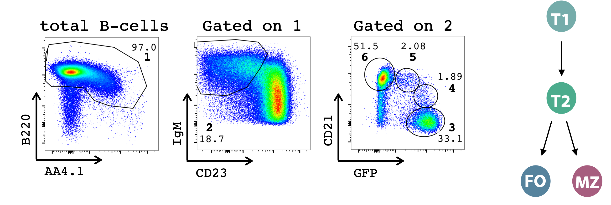
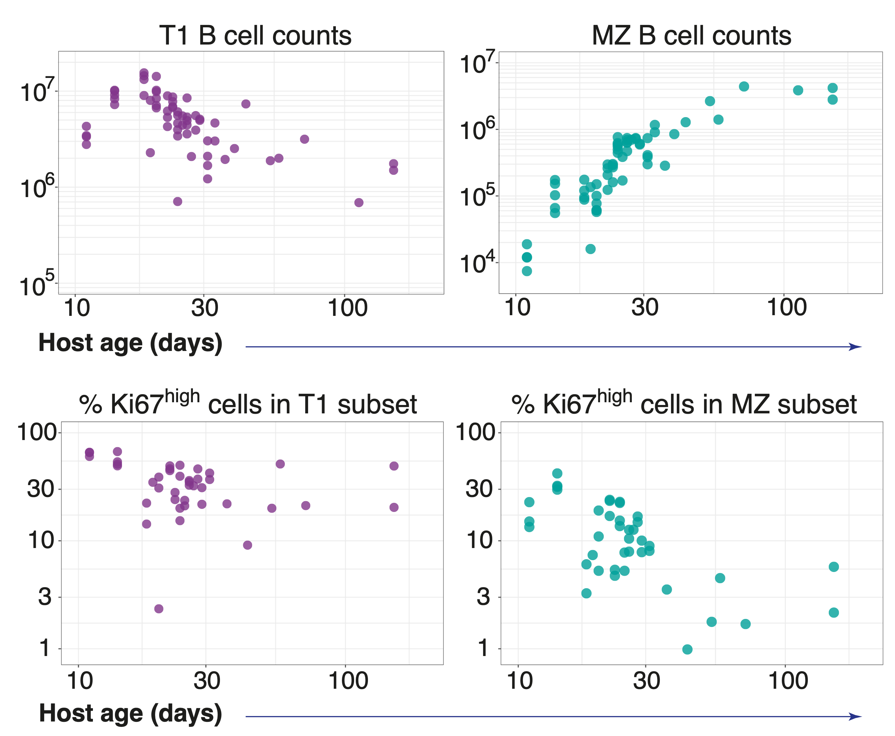
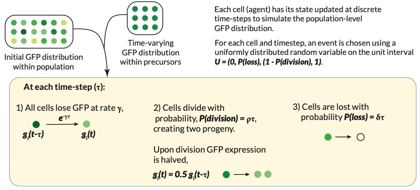

class: center, middle, inverse

## 2. What mechanisms govern the establishment of MZ B cell niche in early life?


???
Kinetics of development in early life $\rightarrow$ how newly made cells populate developing lymphoid niches? 

Early life is a critical phase of immune development in which newly generated lymphocytes quickly populate and adapt to rapidly changing tissue environments. 

Studying these dynamics early in life is important because they leave a strong imprint on lymphocyte subset numbers and diversity in the longer term.

Rag-gfp mice allows to study dynamics of recently exported cells and their division history.


---
class: inverse

## Dynamics in early life
<hr>

- Neonatal period is critical for immune development.

--

  - Newly generated lymphocytes quickly populate and adapt to rapidly changing tissue environments.

--

- We have recently demonstrated that the efficiency of development of FO B cells is lower in neonates than in adults.

.right[
<p style="font-size:90%; color:#ffffff;"> Verheijen et al. Cell Reports 2020 </p>
]
--

  -  Do similar host age-effects manifest in MZ B cell dynamics?

--

### Very little is known about the processes that regulate MZ B cell development and maintenance in early life.

---
<hr>

### Rag<sup>GFP</sup> Ki67<sup>RFP</sup> mouse model

- GFP is expressed in developmental stages in the BM and is turned off upon export to the spleen.

- B cells in periphery dilute GFP by,
> cellular ageing: exponential decline as GFP gets degraded within cells.
>
> cell-division: GFP is distributed equally between progeny.

--


<br>


```{r echo=FALSE, fig.retina=3, out.width='80%'}


```

---


<hr>


```{r echo=FALSE, fig.retina=3, out.width='75%'}


```

.right[
#####Data from Seddon lab
]
<br>

<hr>
---

### Out-of-sample prediction approach
<hr>

1. Extend on the analysis from busulfan chimera data.

2. Extrapolate the best-fitting model/s back to near-birth (age $\sim$ 1 wk).

3. Use the parameters derived from adult (age > 7 wks)  mice.

4. Make predictions of cell counts, Ki67<sup>high</sup> fraction and GFP dynamics in neonates.

--

#### Advantages:

> - Cross validation on untrained data.

--

> - Comparative analysis of early and adult life dynamics.

???
instead of solely relying on statistical support
How well the rates measured in adult mice can capture neonatal data.

---

## Agent-based modelling
<hr>


<br>
```{r echo=FALSE, fig.retina=3, out.width='95%'}


```

<br>

<hr>


